# Guide d'utilisation

## Table des matières

1. [Se connecter](#se-connecter)
2. [Création d'une nouvelle autorité](#creation-autorite)
    1. [Le reste pour une autorité racine](#autorite-racine)
    2. [Le reste pour un certificat HTTPS](#https)

## Se connecter [se-connecter]

Connectez-vous grâce aux logins qu'un administrateur de la plateforme vous aura créé.

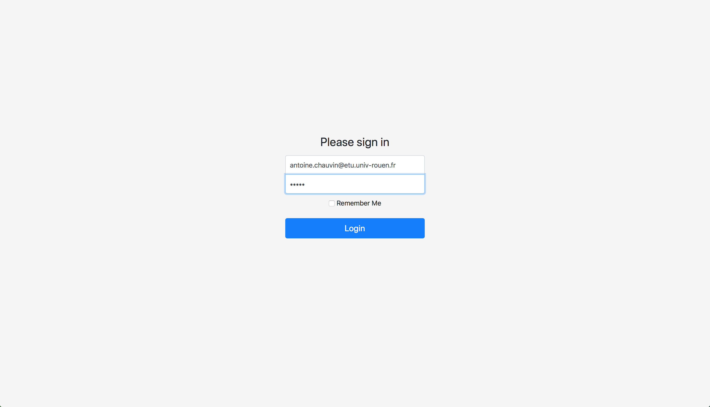

## Création d'une nouvelle autorité [creation-autorite]

Ouvrez les autorités que vous controlez

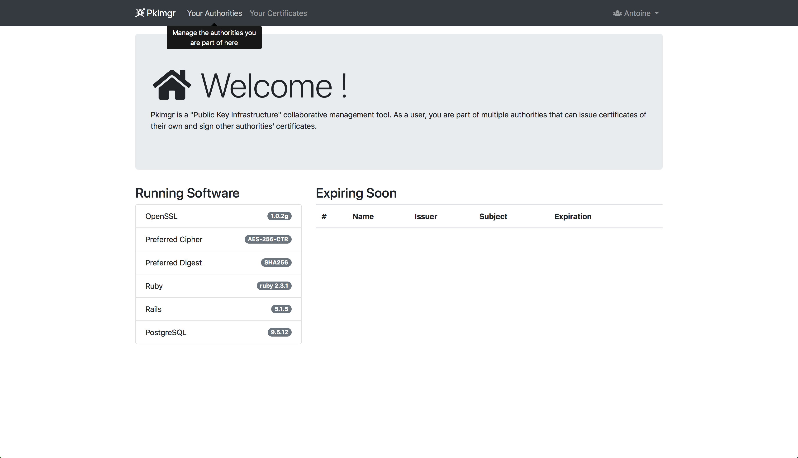

Appuyez sur "New Authority"

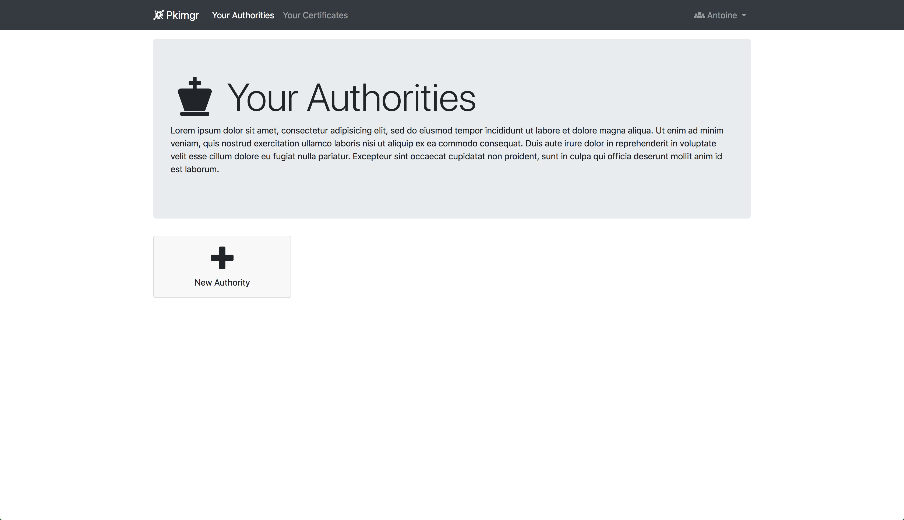

Remplissez le formulaire de création

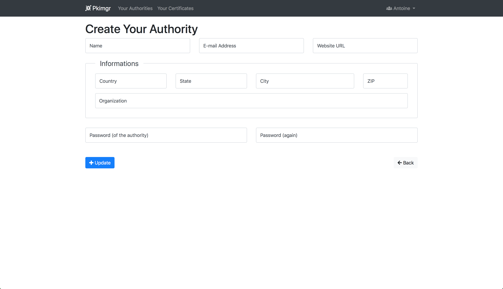

Admirez le résultat

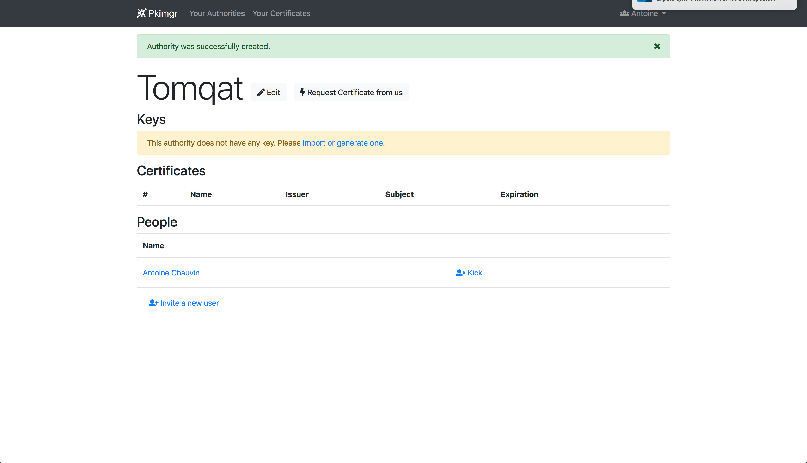

Importez ou générez une nouvelle clé en appuyant sur le lien "import or generate one"

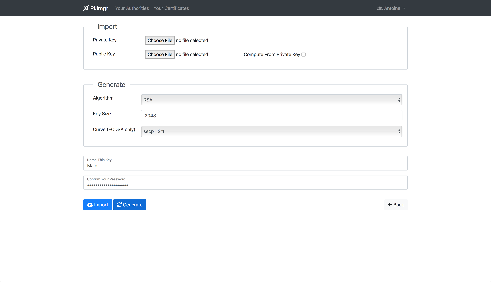

#### Le reste pour une autorité racine [autorite-racine]

Commencez le processus de requête d'un nouveau certificat en appuyant sur "Request Certificate from us"

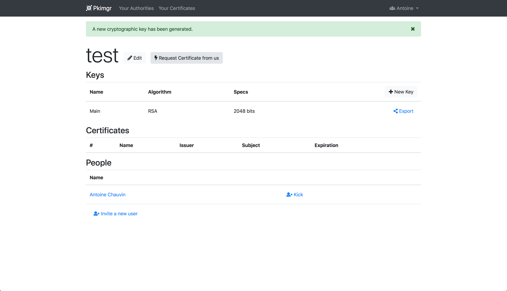

Choisissez l'autorité racine

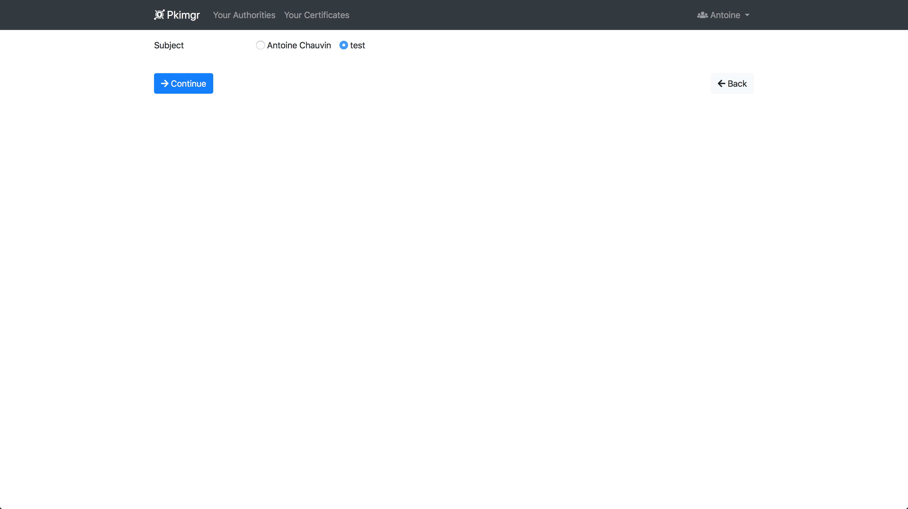

Remplissez le formulaire

- **Certificate Name** : le nom du certificat qui sera affiché en tant que "Common Name"
- **Subject Key** : avec quelle clé vous souhaitez créer un certificat + le mot de passe de la clé
- **Profile** : gardez "Authority"

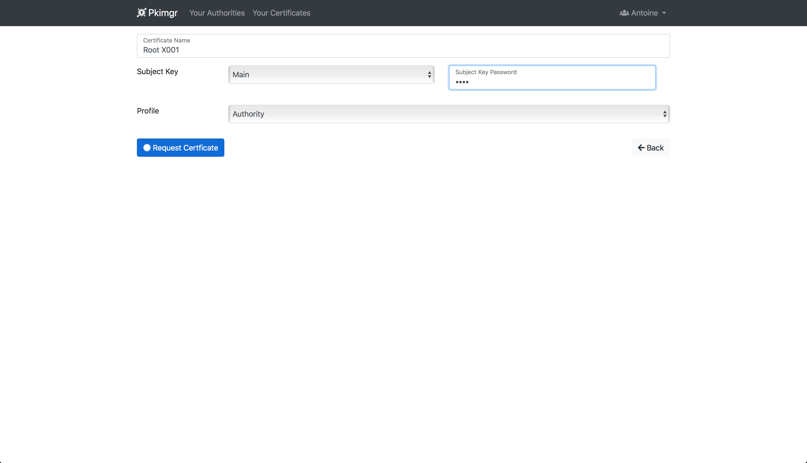

Vous êtes redirigé sur l'autorité, maintenant acceptez la requête

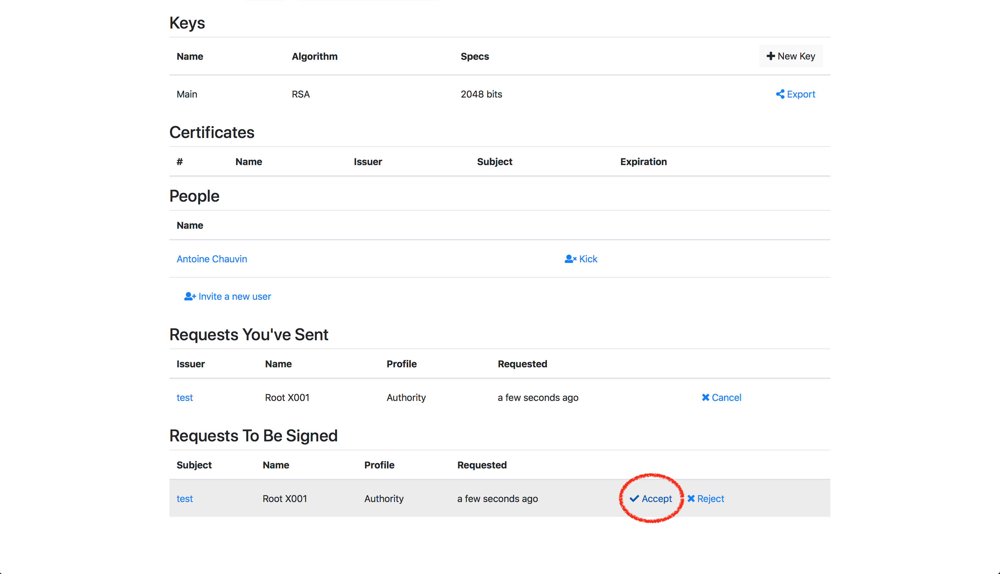

Vérifiez la requête qui est affichée, vérifiez le **Profile** qui a été choisi (dans notre cas veuillez gardez "Authority"), choisissez une durée de validité **Validity** pour le certificat qui sera généré, choisissez avec quel certificat existant vous souhaitez créer le nouveau avec **Sign With**, gardez **Self-Signing** pour faire notre certificat racine.

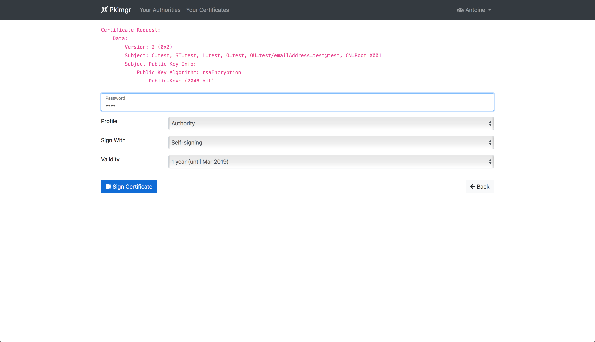

Le certificat est désormais généré, vous pouvez le télécharger avec le bouton "Download"

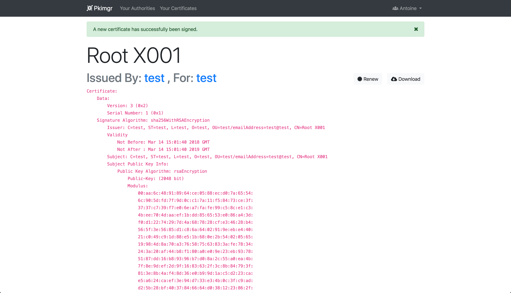

#### Le reste pour un certificat HTTPS [https]

Commencez par créer une nouvelle clé.

Demandez un certificat auprès de l'autorité de votre choix en allant sur sa fiche et en cliquant sur "Request Certificate from us"

Choisissez qui recevra le nouveau certificat

Remplissez le formulaire :

- **Certificate Name** : entrez le nom de domaine que vous souhaitez sécuriser
- **Subject Key** : sélectionnez la clé qui a été généré tout à l'heure + son mot de passe
- **Profile** : choisissez "Web Server (Nginx, Apache, …)"

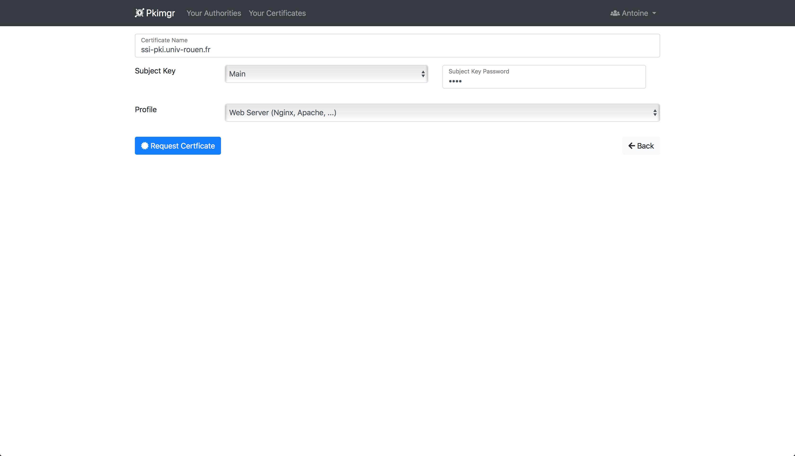

Attendez que l'autorité accepte votre demande. Vous trouverez par la suite votre certificat dans la liste offerte par "Your Certificates"

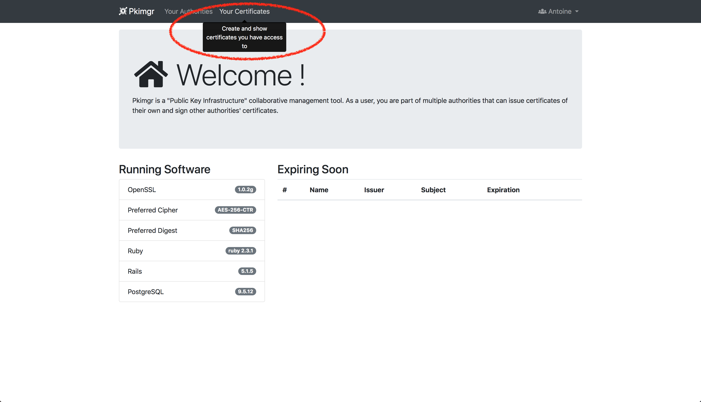
